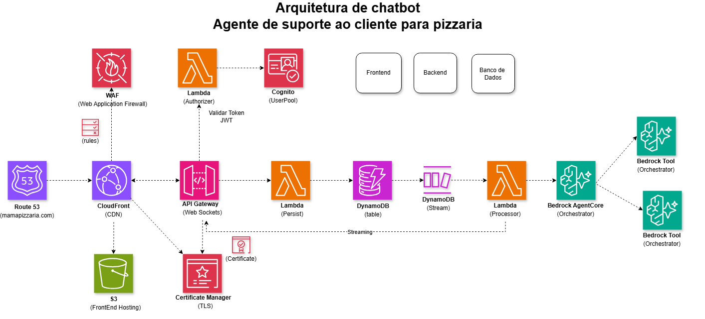

# AWS Chatbot Corporativo

Este repositório reúne a aplicação web de um chatbot empresarial e a infraestrutura necessária para publicá-la na AWS. O projeto combina React + TypeScript no frontend com Terraform para provisionar a infraestrutura de hosting, autenticação e integração com serviços de backend.

## Visão geral

A solução foi pensada para seguir a arquitetura ilustrada abaixo:

- Frontend estático em React + TypeScript
- Autenticação com Amazon Cognito
- Hospedagem via S3 + CloudFront
- API Gateway WebSocket com Lambda Authorizer
- Lambdas de conexão/desconexão com registro em DynamoDB
- Processamento de mensagens em uma Lambda
- Integração direta com a Converse API do Amazon Bedrock

A referência visual da arquitetura está no arquivo [arquitetura-chatbot.drawio](arquitetura-chatbot.drawio).

<p align="center">
  
</p>

### Legenda da arquitetura

- Frontend: aplicação web hospedada em S3 e entregue por CloudFront
- Cognito: autenticação de usuários e emissão de tokens
- API Gateway WebSocket: canal de comunicação em tempo real
- Lambda Authorizer: valida o token do Cognito antes de permitir a conexão do cliente
- Lambda Connect: registra a conexão do usuário no DynamoDB quando a sessão WebSocket é aberta
- Lambda Disconnect: remove ou atualiza o estado da conexão quando o cliente fecha a sessão
- DynamoDB: armazenamento das conexões WebSocket ativas
- Lambda de mensagens: encaminha o histórico recente ao Amazon Bedrock e publica a resposta no WebSocket
- Amazon Bedrock: geração das respostas do assistente
- WAF e Route 53: proteção e acesso do sistema via domínio

### Fluxo de conexão e autenticação

1. O usuário acessa o frontend e faz login no Cognito.
2. O cliente abre uma conexão WebSocket para o API Gateway.
3. O Lambda Authorizer valida o token antes de autorizar a conexão.
4. O Lambda Connect registra a conexão ativa no DynamoDB.
5. O cliente envia mensagens pela rota `sendMessage`; a Lambda invoca o Bedrock e publica a resposta na conexão WebSocket.
6. Quando o cliente desconecta, o Lambda Disconnect remove a conexão do DynamoDB.

### API Gateway + WebSockets + Lambda

O chatbot já está disponível globalmente e os usuários conseguem se autenticar. Mas, após enviar uma mensagem, como essa interação continua em tempo real?

Para manter uma comunicação bidirecional entre cliente e servidor, usamos o API Gateway com WebSockets. Esse serviço mantém a conexão aberta com o usuário, permitindo envio e recebimento de mensagens sem a necessidade de servidores permanentemente ativos.

As funções Lambda processam os eventos de conexão e mensagem. A Lambda de mensagens envia o histórico recente ao Amazon Bedrock e devolve a resposta pelo WebSocket. O DynamoDB registra as conexões ativas; o histórico permanece em memória no navegador.

Em resumo, o WebSocket mantém a conversa viva, a Lambda integra com o Bedrock e o DynamoDB mantém o registro das conexões ativas.

## Stack principal

- Frontend: React 18, TypeScript e Vite
- Autenticação: Amazon Cognito + amazon-cognito-identity-js
- Infraestrutura: Terraform
- Deploy do frontend: S3 + CloudFront
- Comunicação: WebSocket via API Gateway
- Integração com IA: Amazon Bedrock Converse API

## Estrutura do repositório

```text
.
├── arquitetura-chatbot.drawio      # Diagrama da arquitetura
├── frontend/                       # Aplicação web do chatbot
│   ├── public/
│   ├── src/
│   ├── package.json
│   ├── vite.config.ts
│   └── README.md
├── infra/                          # Infraestrutura em Terraform
│   ├── _backend.tf
│   ├── _provider.tf
│   ├── _variables.tf
│   ├── cognito.tf
│   ├── deploy.tf
│   ├── main.tf
│   ├── outputs.tf
│   ├── prd.tfvars
│   └── README.md
├── README.md                      # Documentação principal
└── files/                         # Arquivos auxiliares e artefatos do projeto
```

## Como o frontend funciona

A aplicação em [frontend](frontend) implementa uma interface de chat com:

- tela de login e cadastro
- autenticação no Cognito
- sessão do usuário gerenciada pelo SDK do Cognito
- conexão WebSocket para envio e recebimento de mensagens em tempo real
- renderização das mensagens do assistente

A configuração de ambiente é feita por variáveis com prefixo `VITE_`, por exemplo:

```bash
VITE_COGNITO_USER_POOL_ID
VITE_COGNITO_CLIENT_ID
VITE_COGNITO_REGION
VITE_WS_URL
VITE_ASSISTANT_NAME
```

Essas variáveis são lidas em [frontend/src/config.ts](frontend/src/config.ts) e usadas no fluxo de autenticação e na conexão do socket do chat.

## Requisitos

Antes de iniciar, certifique-se de ter instalado:

- Node.js 18+
- npm
- Terraform
- AWS CLI configurado com credenciais válidas
- Acesso a uma conta AWS com permissões para criar recursos como S3, CloudFront, Cognito e Lambda

## Executando o frontend localmente

```bash
cd frontend
npm install
npm run dev
```

A aplicação fica disponível em modo de desenvolvimento pelo Vite, normalmente em `http://localhost:5173`.

### Build de produção

```bash
cd frontend
npm run build
```

O resultado fica em `frontend/dist` e pode ser publicado em um bucket S3 ou entregue por um pipeline de deploy.

## Provisionando a infraestrutura com Terraform

A pasta [infra](infra) contém a infraestrutura necessária para provisionar o frontend, o bucket S3, a distribuição CloudFront e o Cognito.

### Passo a passo

```bash
cd infra
terraform init -var-file="prd.tfvars"
terraform validate
terraform plan -var-file="prd.tfvars"
terraform apply -auto-approve -var-file="prd.tfvars"
```

O Terraform também gera automaticamente o arquivo `.env` do frontend com os valores do Cognito e da URL do WebSocket quando `auto_deploy` está habilitado.

### Configuração principal

Os principais parâmetros estão em [infra/_variables.tf](infra/_variables.tf), incluindo:

- `region`
- `environment`
- `organization_name`
- `application_name`
- `auto_deploy`
- `manage_cognito_user_pool`
- `ws_url`
- `assistant_name`

A variável `ws_url` deve apontar para o endpoint WebSocket do backend do chatbot, por exemplo:

```bash
wss://xxxxxxxxxx.execute-api.us-east-1.amazonaws.com/prod
```

## Deploy e publicação

O fluxo de deploy implementado em [infra/deploy.tf](infra/deploy.tf) executa automaticamente:

1. `npm install` e build do frontend
2. sincronização do conteúdo em `dist` para o bucket S3
3. invalidação do cache do CloudFront

A infraestrutura cria um bucket S3 privado e restringe o acesso somente à distribuição CloudFront por meio de Origin Access Control, o que é o padrão recomendado para hospedagem de sites estáticos.

## Documentação complementar

Para detalhes específicos do frontend e da infraestrutura, consulte:

- [frontend/README.md](frontend/README.md)
- [infra/README.md](infra/README.md)

## Observações importantes

- O backend completo não está neste repositório; o projeto assume a existência de um serviço WebSocket já implementado ou em outro stack AWS.
- O frontend depende de `VITE_WS_URL` e do `idToken` do Cognito para autenticar a conexão WebSocket.
- O arquivo [arquitetura-chatbot.drawio](arquitetura-chatbot.drawio) é a referência mais completa da solução de arquitetura.

## Próximos passos recomendados

- verificar se o backend WebSocket está protegido pela Lambda Authorizer
- validar o fluxo de autenticação e login do Cognito em ambiente real
- ajustar o nome do assistente e a identidade visual da aplicação
- configurar DNS, certificado TLS e WAF para produção

---

Este repositório funciona como base para um chatbot corporativo em AWS, com frontend moderno e infraestrutura automatizada em Terraform.
